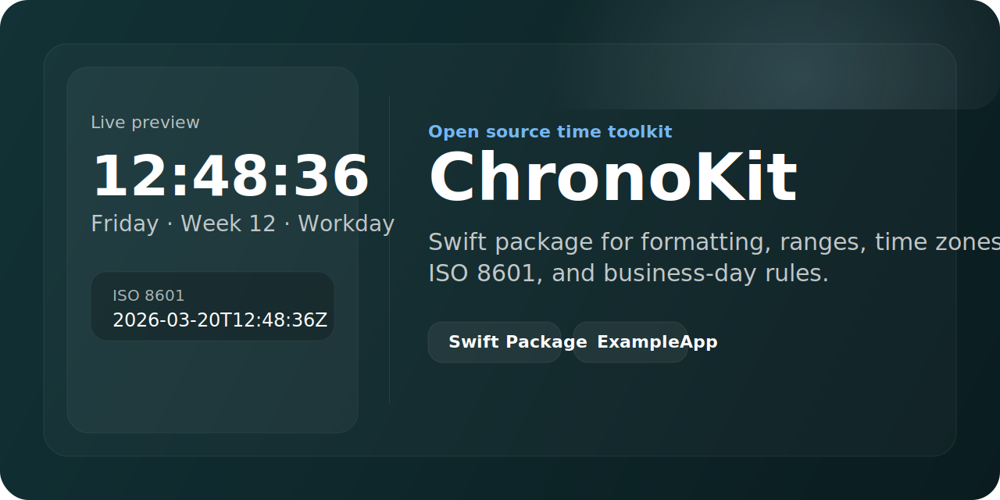

# ChronoKit



`ChronoKit` 是一个面向 Swift 开发者的时间处理工具库，提供时间格式化、时间戳转换、日期边界计算、时间比较、时区换算、ISO8601、工作日/节假日规则等能力。

`ChronoKit` 同时提供两种使用方式：

- Swift Package：适合把 `ChronoKit` 当作库接入项目
- Xcode Demo 工程：适合直接运行和查看能力展示

## Why ChronoKit

- 获取当前时间、时间戳、时间快照
- 时间字符串与 `Date`、Unix 时间戳双向转换
- ISO8601 格式化与解析
- 年、季度、月、周、日、时、分、秒、星期等组件提取
- 月初月末、周初周末、年初年末、日期区间计算
- 同日、同周、同月、同年比较
- 天数、小时、分钟、秒差值计算
- 指定时区格式化与跨时区时间转换
- 周末、节假日、调休工作日、自定义业务日规则
- 模块化 API，避免时间方法平铺堆积

## Quick Start

```swift
import ChronoKit

let manager = TimeManager()

let text = manager.currentString(format: "yyyy-MM-dd HH:mm:ss")
let iso = manager.iso8601String(from: manager.currentDate())
let snapshot = manager.currentSnapshot()

print(text)
print(iso)
print(snapshot.weekdayText)
```

## Requirements

- Swift 6+
- Xcode 16+
- iOS 16.6+
- macOS 10.15+
- tvOS 13+
- watchOS 6+

## Installation

### Swift Package Manager

在你的 `Package.swift` 中加入：

```swift
.package(url: "https://github.com/your-name/ChronoKit.git", from: "1.0.0")
```

然后在 target 依赖中引入：

```swift
.product(name: "ChronoKit", package: "ChronoKit")
```

代码里直接：

```swift
import ChronoKit
```

## API Overview

推荐优先通过模块入口访问能力，而不是把所有方法都当成一个平铺工具类来记。

模块入口包括：

- `manager.formatting`
- `manager.calendarTools`
- `manager.comparison`
- `manager.timeZones`
- `manager.business`

### Formatting

```swift
let manager = TimeManager()

let text = manager.formatting.string(from: Date(), format: "yyyy-MM-dd HH:mm:ss")
let date = manager.formatting.date(from: "2026-03-20 18:30:45", format: "yyyy-MM-dd HH:mm:ss")
let iso = manager.formatting.iso8601String(from: Date())
let relative = manager.formatting.relativeDescription(
    for: Date().addingTimeInterval(2 * 24 * 3600),
    relativeTo: Date()
)
```

### Calendar Tools

```swift
let manager = TimeManager()
let now = Date()

let dayRange = manager.calendarTools.dayRange(for: now)
let monthStart = manager.calendarTools.startOfMonth(for: now)
let monthEnd = manager.calendarTools.endOfMonth(for: now)
let nextWeek = manager.calendarTools.adding(7, component: .day, to: now)
```

### Comparison

```swift
let manager = TimeManager()
let now = Date()
let tomorrow = manager.calendarTools.adding(1, component: .day, to: now)!

let sameDay = manager.comparison.isSameDay(now, tomorrow)
let days = manager.comparison.daysBetween(now, tomorrow)
let result = manager.comparison.compare(now, tomorrow)
```

### Time Zones

```swift
let manager = TimeManager()
let shanghai = TimeZone(identifier: "Asia/Shanghai")!
let newYork = TimeZone(identifier: "America/New_York")!

let newYorkText = manager.timeZones.string(
    from: Date(),
    format: "yyyy-MM-dd HH:mm:ss",
    in: newYork
)

let converted = manager.timeZones.convert(
    string: "2026-03-20 18:30:45",
    format: "yyyy-MM-dd HH:mm:ss",
    from: shanghai,
    to: newYork,
    outputFormat: "yyyy-MM-dd HH:mm:ss"
)
```

### Business Calendar

```swift
let businessCalendar = BusinessCalendar(
    recurringHolidays: [MonthDay(month: 1, day: 1)],
    oneOffHolidays: [DayKey(year: 2026, month: 10, day: 2)],
    extraWorkdays: [DayKey(year: 2026, month: 10, day: 10)]
)

let manager = TimeManager(businessCalendar: businessCalendar)
let targetDate = manager.date(from: "2026-10-02 10:00:00", format: "yyyy-MM-dd HH:mm:ss")!

print(manager.business.isHoliday(targetDate))
print(manager.business.isWorkday(targetDate))
print(manager.business.nextWorkday(after: targetDate) ?? targetDate)
```

## Demo

仓库内提供可直接运行的示例工程：

- 工程路径：`Demo/ExampleApp.xcodeproj`
- App target：`ExampleApp`
- 打开后选择任意 iOS Simulator，按 `Command + R` 即可运行

## Compatibility Notes

为了兼容已有调用，`TimeManager` 仍然保留了一层常用快捷方法，例如：

- `currentString(format:)`
- `timestamp(from:format:inMilliseconds:)`
- `string(fromTimestamp:format:isMilliseconds:)`
- `snapshot(from:format:weekdayStyle:)`
- `isSameDay(_:_)`
- `isWorkday(_:)`

如果是新代码，建议优先使用模块化入口。

## Project Structure

```text
Demo/
  ExampleApp.xcodeproj/
  ExampleApp/
Sources/
  ChronoKit/
Tests/
  ChronoKitTests/
Package.swift
```

## Testing

库测试：

```bash
swift test
```

Demo 编译验证：

```bash
xcodebuild -scheme ExampleApp \
  -project Demo/ExampleApp.xcodeproj \
  -destination 'id=0B2CBF66-8002-436C-9EFD-42AE63930178' \
  build CODE_SIGNING_ALLOWED=NO
```

## Design Notes

- 使用 `yyyy` 而不是 `YYYY`
- 所有核心能力都基于 `Foundation`
- `Date` 代表绝对时间点，时区转换主要体现在解析和格式化层
- 业务日规则通过 `BusinessCalendar` 注入，避免把地区规则写死在核心类中

## License

MIT
